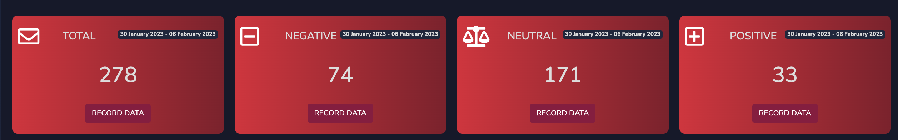
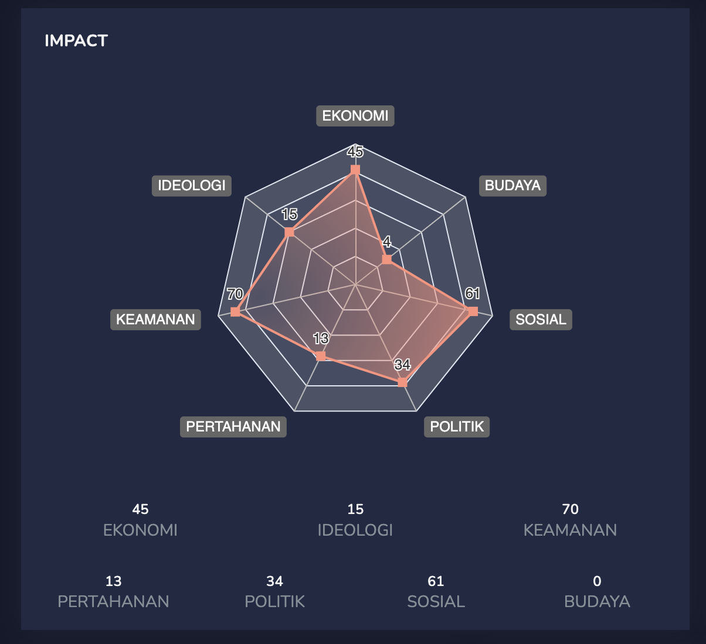
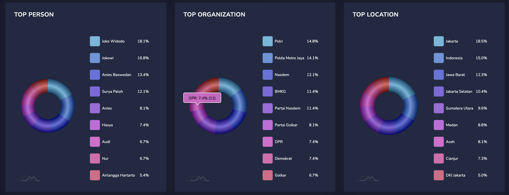
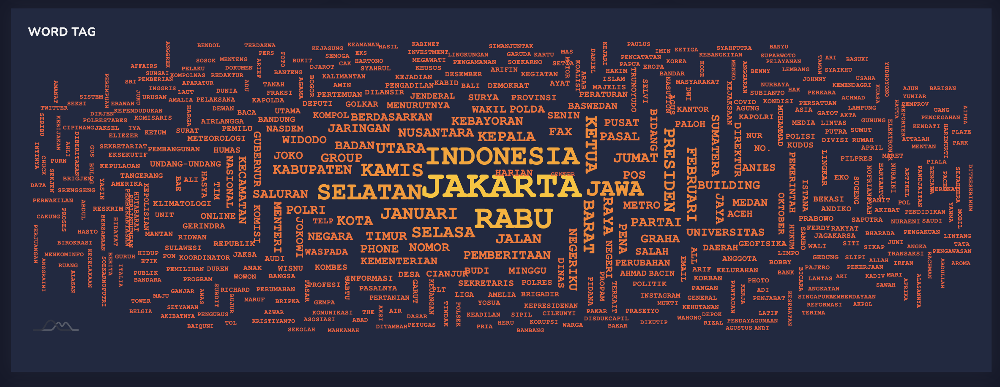
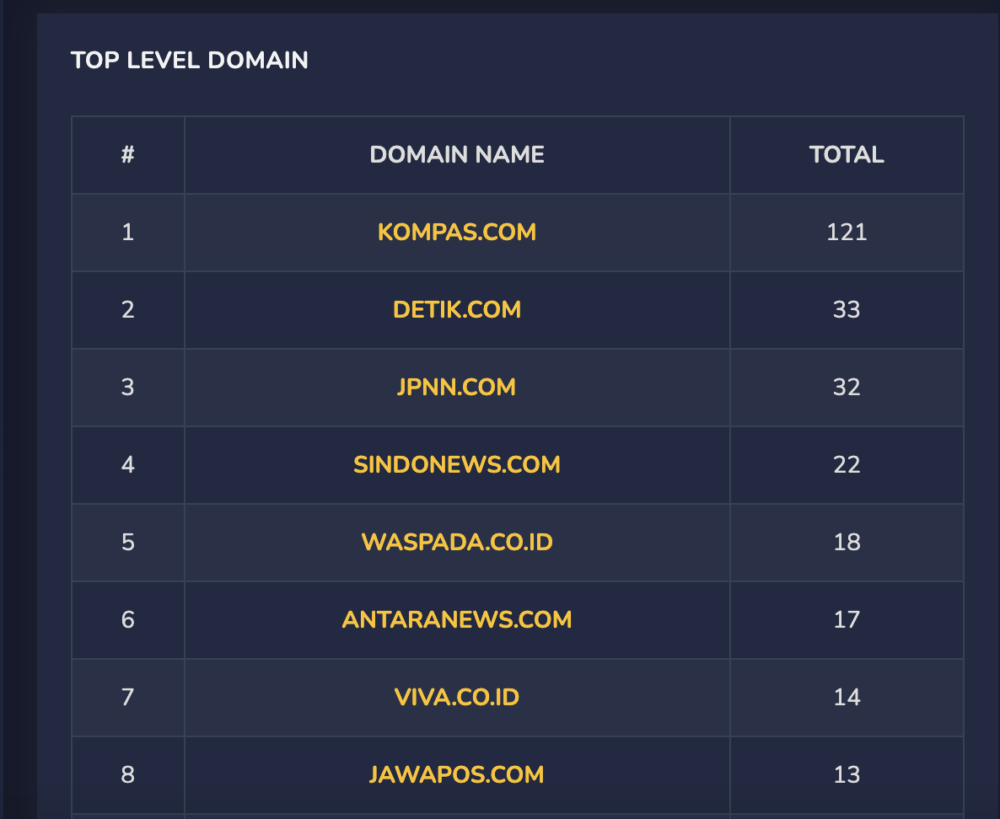
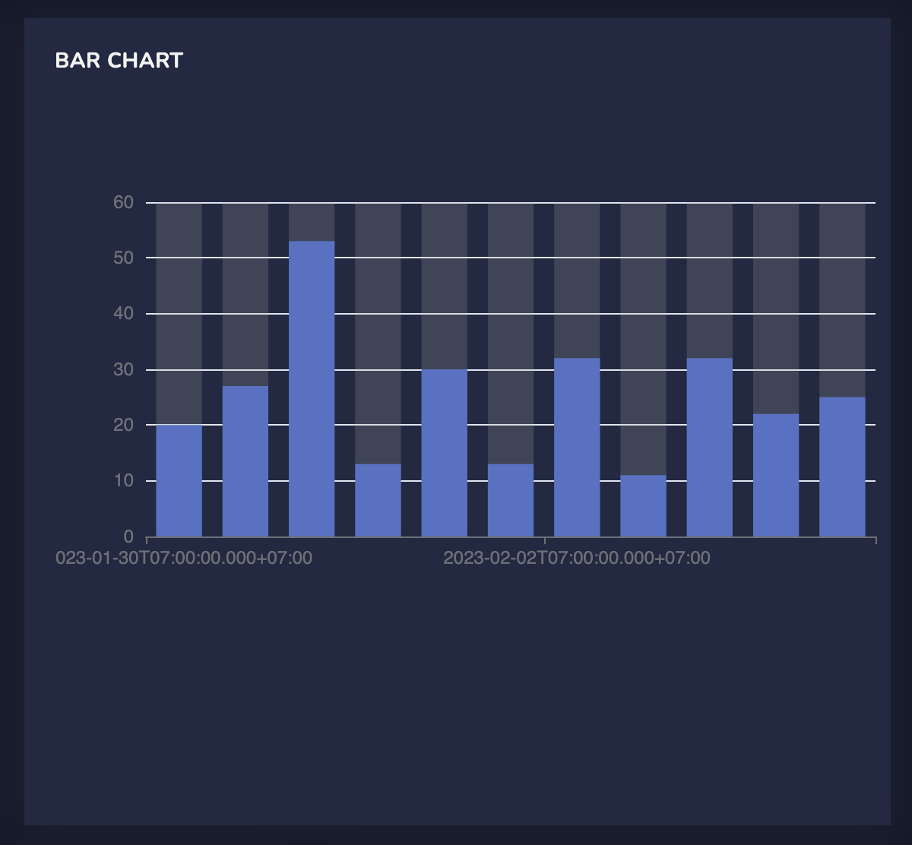
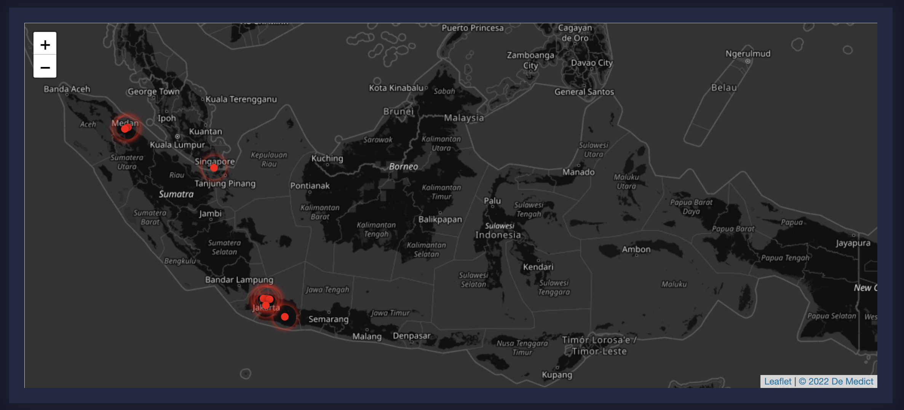

#### TEST CASE

```
    1. BUAT DASHBOARD DENGAN DATA YANG TELAH DI SEDIAKAN MELIPUTI 
       (https://www.amcharts.com/demos-v4/)
       - MAPS 
       - PIE CHART / DONUT CHART
       - TIME SERIES
       - TEXT COUNT SENTIMEN NEGATIF,POSITIF,NETRAL

    2. BUAT TABLE LIST WITH PAGINATION, DATE FILTER , FILTER KEYWORD
       
```

### EXAMPLE IMAGES






